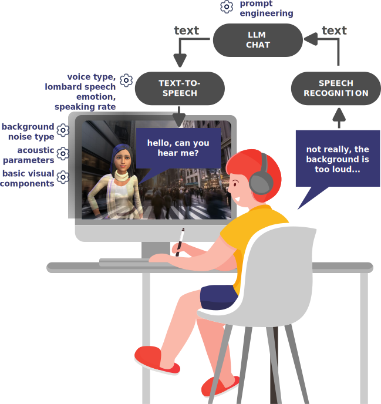

## Chat Aid: The Voice Agent To Assess Speech Communication  

A research-oriented web application designed to test communication in noisy environments in an interactive way. 

## Key Components:

-  Real-time voice interaction with a low-latency AI agent (Gemini Multimodal Live API)
-  Role-Play Experiment in a Common Complex Acoustic Scenario (Restaurant)
-  Specialized Audio Processing:
   - Binaural restaurant babble noise (ARTE database)
   - Custom HRTF-based auralization (BRIR matching the restaurant scene)
   - SNR control 
- Data Collection:
  - Participant demographic form (Age, Gender, Hearing Status, etc.).
  - Interactive questionnaire to evaluate task understanding.
  - Automatic download of results (`.txt`) and session recording (`.wav`).
